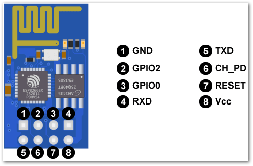

# 为esp8266安装micropython



## 安装烧录工具

```
sudo pip install esptool
```


首先擦除
```
esptool.py --port /dev/ttyUSB0 erase_flash
```

烧录固件
```
esptool.py --port /dev/ttyUSB0 --baud 460800 write_flash --flash_size=detect 0 esp8266-20191220-v1.12.bin
```

# 串口交互


> GPIO1=TX, GPIO3=RX


```
picocom -port /dev/ttyUSB0 115200
```

# wifi交互
> 
> wifi:MicroPython-xxxxxx
> passwd:micropythoN
> 
> 

## live 调试


```
pip3 install dafruit-ampy
```

设置变量

```
export AMPY_PORT=/dev/ttyUSB0
export AMPY_BAUD=115200
AMPY_DELAY=0.5
```

全部命令

> Commands:
  get  Retrieve a file from the board.
  ls   List contents of a directory on the board.
  put  Put a file on the board.
  rm   Remove a file from the board.
  run  Run a script and print its output.

例如：

list
```
ampy ls
```
